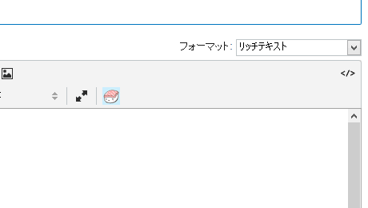
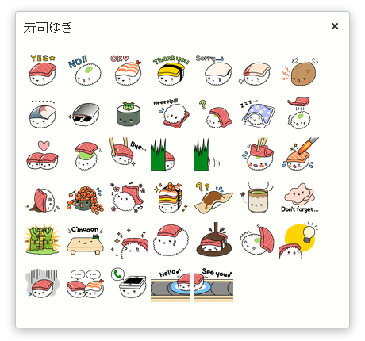

# SushiForTinyMCE

Movable Type 5.2 から標準搭載されているリッチエディタ TinyMCE に寿司ゆきアイコンを追加するプラグインです。
ゆるふわな雰囲気が特徴のお寿司のキャラクター「寿司ゆき」アイコンを記事内に追加できます。

[寿司ゆき (SUSHIYUKI) - ゆるふわお寿司のLINEスタンプ](http://awayuki.net/sushiyuki/)

## 使い方

インストールすると寿司ゆきのボタンがリッチエディタの 2 段目右側に追加されます。

このボタンをクリックすると寿司ゆきアイコン一覧が表示されますので、使いたい寿司ゆきアイコンをクリックしてください。

## インストール

mt-static と plugins を、Movable Type のインストールディレクトリにアップロードしてください。

## 寿司ゆきイラストについて

同梱している 寿司ゆきのイラストはすべてawayukiさん作の『折り詰め寿司ゆき』を使用しています。

『折り詰め寿司ゆき』は[クリエイティブ・コモンズライセンス (CC BY-NC-ND 4.0)](http://creativecommons.org/licenses/by-nc-nd/4.0/deed.ja)で提供されています。